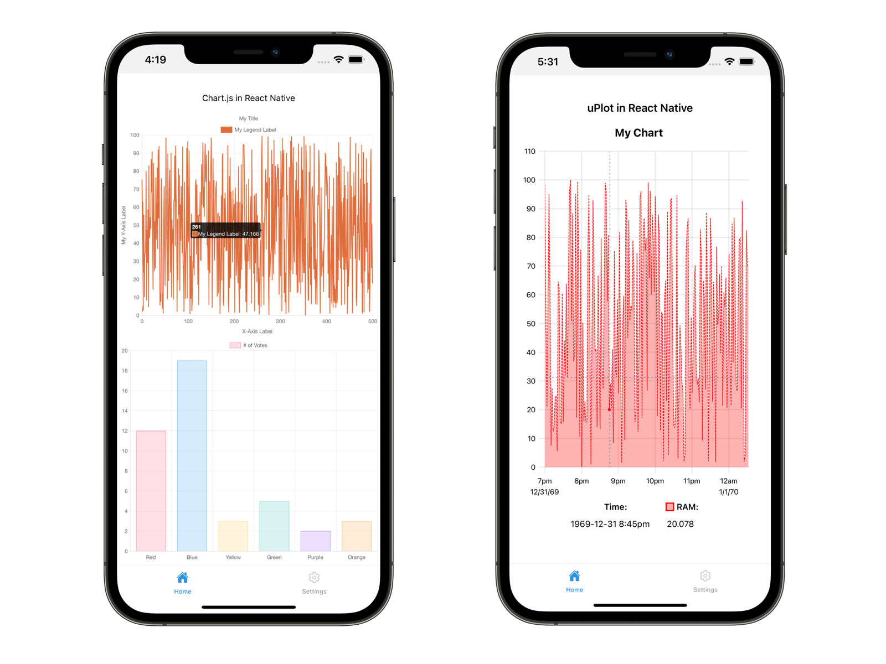

# react-native-canvas-charts


[react-native-canvas-charts](https://github.com/dpwiese/react-native-canvas-charts) provides a simple wrapper around [react-native-webview](https://github.com/react-native-webview/react-native-webview) for making canvas-based charts in React Native.
Read more in the post [Canvas Charts in React Native](https://danielwiese.com/posts/react-native-canvas-charts/).
Currently supports [Chart.js](https://www.chartjs.org) and [uPlot](https://github.com/leeoniya/uPlot).



## Install

```sh
% npm i --save react-native-webview @dpwiese/react-native-canvas-charts
% cd ios && pod install
```

## Using

### Chart.js

Currently [react-native-canvas-charts](https://github.com/dpwiese/react-native-canvas-charts) only supports [Chart.js](https://www.chartjs.org) version 3.
To use, simply import `Chart`, define the standard Chart.js [Dataset Configuration](https://www.chartjs.org/docs/master/configuration/index#dataset-configuration) and pass it to the `config` prop.

```js
import { Chart } from "@dpwiese/react-native-canvas-charts/ChartJs";

const chartConfig = {
  type: "line",
  data: {
    datasets: [
      {
        label: "My Legend Label",
        backgroundColor: "rgb(224, 110, 60)",
        borderColor: "rgb(224, 110, 60)",
        data: [
          { x: 1, y: 2 },
          { x: 2, y: 5 },
          { x: 3, y: 3 },
        ],
        fill: false,
        pointRadius: 0,
        lineTension: 0.1,
        borderJoinStyle: "round",
      },
    ],
  },
  options: {
    animation: {
      duration: 0,
    },
    responsive: true,
    plugins: {
      title: {
        display: true,
        text: "My Title",
      },
      tooltip: {
        mode: "index",
        intersect: false,
      },
    },
    hover: {
      mode: "nearest",
      intersect: true,
    },
    scales: {
      x: {
        type: "linear",
        display: true,
        scaleLabel: {
          display: true,
          labelString: "My X-Axis Label",
        },
        ticks: {
          autoSkipPadding: 100,
          autoSkip: true,
          minRotation: 0,
          maxRotation: 0,
        },
      },
      y: {
        display: true,
        scaleLabel: {
          display: true,
          labelString: "My Y-Axis Label",
        },
      },
    },
  },
};

export default () => <Chart config={chartConfig}/>;
```

#### Streaming Data

To stream data to the chart, the `setData` ref can be used as below

```js
import { Chart, SetData } from "@dpwiese/react-native-canvas-charts/ChartJs";
import { useRef } from "react";
import { chartConfig } from "./chartConfig";

export default () => {
  const setDataRef = useRef<SetData>();

  // Update the charted data with newData
  setDataRef.current.setData(newData);

  return (<Chart config={chartConfig} ref={setDataRef}/>);
}
```

### uPlot

[uPlot](https://github.com/leeoniya/uPlot) is a very performant canvas-based plotting library supported by [react-native-canvas-charts](https://github.com/dpwiese/react-native-canvas-charts).
To use, simply import `UPlot` and pass it [`data`](https://github.com/leeoniya/uPlot/tree/master/docs#data-format) and [`opts`](https://github.com/leeoniya/uPlot/tree/master/docs#basics).

```js
import { UPlot } from "@dpwiese/react-native-canvas-charts/UPlot";

const opts = {
  title: "My Chart",
  id: "chart1",
  class: "my-chart",
  width: 400,
  height: 600,
  series: [
    {},
    {
      show: true,
      spanGaps: false,
      label: "RAM",
      value: (self, rawValue) => "$" + rawValue.toFixed(2),
      stroke: "red",
      width: 1,
      fill: "rgba(255, 0, 0, 0.3)",
      dash: [10, 5],
    },
  ],
};

const data = [
  [0, 100],
  [35, 71],
  [90, 15],
];

export default () => <UPlot opts={opts} data={data}/>;
```
